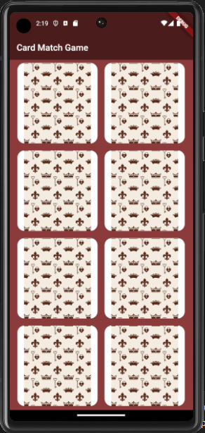
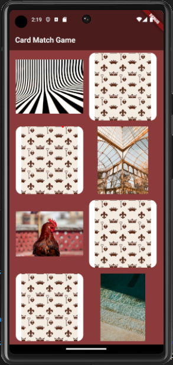

# Flutter Card Match Game

This is a project I am working on to practice and use my Flutter and Dart skills. It is a card match game, much like any other card match game you might've played. At the beginning of the game, all cards will be shuffled. The player picks two cards, the cards are revealed, and the software evaluates whether the cards match. If they don't match, the software should flip them back over and make the player choose again. If they do match, the software will recognize it and make sure the cards stay face up.

The game will also have a timer that keeps track of how long it takes a player to match all the cards, and each player will get a high score, which will be recorded on a backend and displayed on a "High Scores" screen.

# Game Samples

# Game Status

- [x] Card game screen is properly displayed
- [ ] Cards are shuffled
- [x] Cards can be turned over
- [ ] Matches and mismatches are detected and handled
- [ ] Game recognizes when all matches are made
- [ ] Timer functions and records each player's time
- [ ] High Score screen is properly displayed
- [ ] High Score screen loads backend data (each player's name and time)
- [ ] High Score screen sorts scores from lowest time to highest

## Getting Started

This project is a starting point for a Flutter application.

A few resources to get you started if this is your first Flutter project:

- [Lab: Write your first Flutter app](https://docs.flutter.dev/get-started/codelab)
- [Cookbook: Useful Flutter samples](https://docs.flutter.dev/cookbook)

For help getting started with Flutter development, view the
[online documentation](https://docs.flutter.dev/), which offers tutorials,
samples, guidance on mobile development, and a full API reference.

# credits
Back of card image taken from [Image by Olga_spb](https://www.freepik.com/free-vector/monochromatic-crowns-pattern_898717.htm#query=fluer%20de%20lis&position=23&from_view=search&track=ais) on [Freepik](https://www.freepik.com/)

Curvy lines image by [BP Miller](https://unsplash.com/@bp_miller?utm_source=unsplash&utm_medium=referral&utm_content=creditCopyText) on [Unsplash](https://unsplash.com/photos/-TnlLhj46iQ?utm_source=unsplash&utm_medium=referral&utm_content=creditCopyText)
  
Water image by [Zeynep Sümer](https://unsplash.com/@ispywithmylittleeye?utm_source=unsplash&utm_medium=referral&utm_content=creditCopyText) on [Unsplash](https://unsplash.com/photos/e96xL67JrfM?utm_source=unsplash&utm_medium=referral&utm_content=creditCopyText)

Glass house image by [Alev Takil](https://unsplash.com/@alevisionco?utm_source=unsplash&utm_medium=referral&utm_content=creditCopyText) on [Unsplash](https://unsplash.com/photos/eDMQgYbKhiU?utm_source=unsplash&utm_medium=referral&utm_content=creditCopyText)

Photo by [Sardar Faizan](https://unsplash.com/@nexio?utm_source=unsplash&utm_medium=referral&utm_content=creditCopyText) on [Unsplash](https://unsplash.com/photos/FPXFyGPOlrE?utm_source=unsplash&utm_medium=referral&utm_content=creditCopyText)
  
